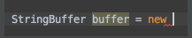
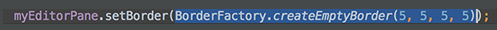
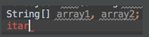
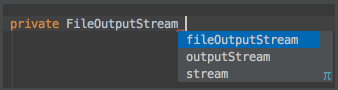
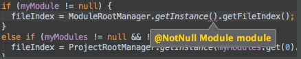

16.The speed search is available in all the tree views: just start typing and you'll quickly locate the necessary item. 
 
   在所有的树视图中，是支持快速模糊搜索的: 只需要输入开头的内容,很快就能定位到你指定的内容。
   
   
 
17.The Esc key in any tool window moves the focus to the editor. 
   Shift+Esc moves the focus to the editor and also hides the current (or last active) tool window. 
   The F12 key moves the focus from the editor to the last focused tool window. 

18.When you want to catch exceptions thrown by some code fragment, select it in the editor, press Ctrl+Alt+T (Code | Surround With) and choose try / catch. The catch blocks for all the exceptions thrown inside the block will be generated automatically. 
   You can customize the bodies of the generated catch blocks on the Code tab of File | Settings | File and Code Templates. 
   Use other items in the list to surround with other constructs. 
 
   
 
19.The SmartType code completion may be used after the new keyword, to instantiate an object of the expected type. For example, type 
 
   
 
   and press Ctrl+Shift+空格: 

   

20.To navigate to the implementation(s) of an abstract method, position the caret at its usage or its name in the declaration and press Ctrl+Alt+B. 

21.Ctrl+W (extend selection) in the editor selects the word at the caret and then selects expanding areas of the source code. For example, it may select a method name, then the expression that calls this method, then the whole statement, then the containing block, etc. You can also select the word at the caret and the expanding areas of the source code by double-clicking the target areas in the editor.

22.The Extract Variable refactoring helps you simplify complicated statements in your code. For example, in the code fragment below, you can select an expression in the code: 
 
   
 
   and press Ctrl+Alt+V (Refactor | Extract | Variable...). This will result in the following: 

   
 
23.You can comment or uncomment lines and blocks of code using Ctrl+斜杠 and Ctrl+Shift+斜杠. 
   Ctrl+斜杠 comments or uncomments the current line or selected block with single line comments (//...). 
   Ctrl+Shift+斜杠 encloses the selected block in a block comment (/*...*/). 
   To uncomment a commented block press Ctrl+Shift+斜杠 anywhere inside it. 

24.To open your browser with documentation for the element at the editor's caret, press Shift+F1 (View | External Documentation). 
   You must have the path to your browser set in the File | Settings | Web Browsers options and paths to documentation files added to your project (File | Project Structure...) to use this feature. 

25.When you need to cast an expression value to the required type the SmartType code completion will help you. For example, type 
   String s = (<caret is here> 
   and press Ctrl+Shift+空格 to see what happens. 

26.Ctrl+D in the editor duplicates the selected block or the current line when no block is selected. 

27.Try Live Templates
   Live Templates allow you to generate many typical code constructs in seconds! For example, type

   
 
   in a method and press the Tab key to see what happens.

   
 
   Use the Tab key to move between the template fields. See File | Settings | Live Templates for more details.

28.The CodeCompletion feature can suggest a name for a variable when you declare it. For example, start typing 
   private FileOutputStream
   and press Ctrl+空格. 

   
 
   You can customize name prefixes for local variables, parameters, instance and static fields in File | Settings | Code Style. 

29.If the cursor is between the parentheses of a method call, pressing Ctrl+P brings up a list of valid parameters. 

   
 
30.Alt+向左箭头 (Navigate | Last Edit Location) brings you back to the last place where you made changes in the code. 
   Pressing Alt+向左箭头 a few times moves you deeper into your changes history. 
